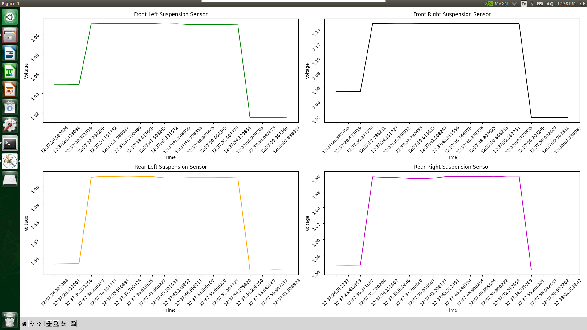
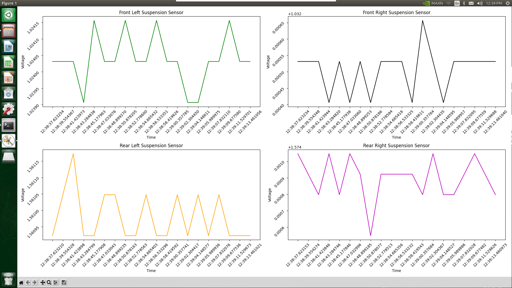

Hall Effect
==========================

Integration
__________________________

The Hall Effect sensors were integrated using an ADS1115 16 bit ADC. The adafruit_ads1x15.ads1115 library was utilized to read the voltages on each channel and then the outputs for each channel are graphed using a real-time plot generated using matplotlib's animate function. The plots below show raw voltages from the sensors.

Full Range of Suspension Travel
__________________________

The full range of motion can be seen on the above graph when the vehicle's suspension is fully compressed on all 4 wheels and then the vehicle is lifted off of the ground to show the suspensions full range. Here we see an average range of about 120mV with each sensor which corresponds with the vehicle's maximum and minimum ride heights.

Noise
__________________________

  
In this image, we see that each Hall Effect sensor's noise floor. This average is about 200 nV. This is great because it means valid suspension travel data will be easily detectable and discernable from the sensor's noise floor, even without amplifying the signal.
