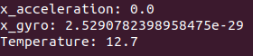

Intertial Measurement Unit
===============================================

The IMU was integrated using self-written driver code. The baud rate likely needs to be updated to a more correct value since "valid" entries are only present every few loops. There is a ton of potential to improve upon the utilization of the IMU's data. Once characterized, it can be used to bridge the gap of data 'blindness' in between the LIDAR data cycles. The IMU can also serve to help with localization when coupled with the car's other systems.
