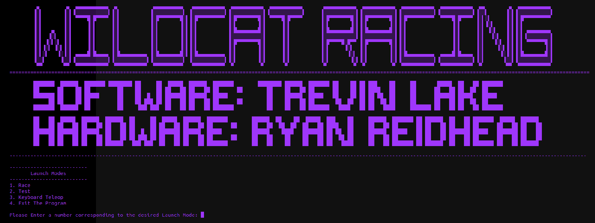

Launcher GUI
========================

  
This launcher script runs ROS commands on the backend using Python's OS library. It launches the launch files found in the 'launch' folder. When the User presses Ctrl+C to kill the currently running launch mode, the script returns to the main menu after closing applicable bash windows. If the User exits the laucher GUI by entering '4' the GUI will close and return to a normal bash. The launcher script must be ran in a shell with root access (using the command sudo -s after opening a bash). This is because some of the scripts ran in the launch files need root access. For example, the LIDAR Ethernet configuration has to be ran as root in order to configure the ethernet port.
