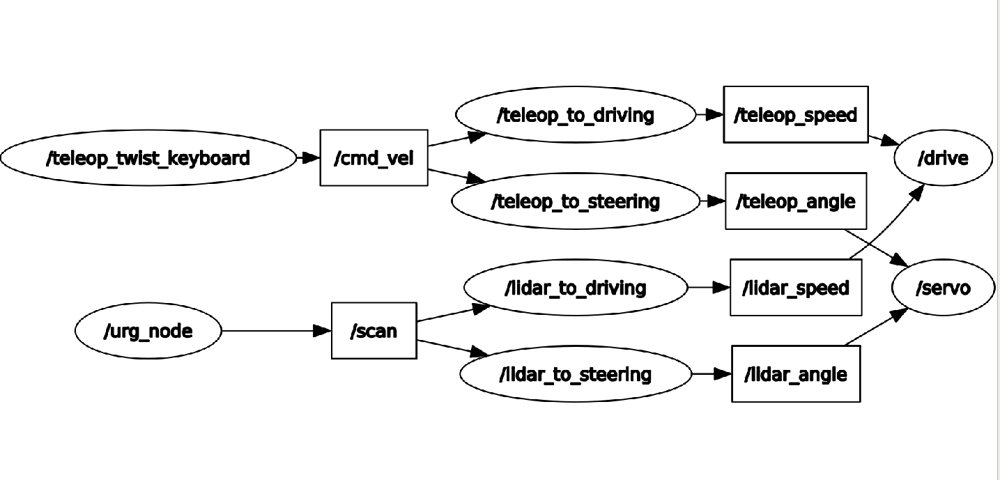

ROS Code
========================

RQT Graph
________________________

  
ROS Node Example - Steering Servo Subscriber Node
________________________
.. code-block:: python
  :linenos:
  :emphasize-lines: 1,9-10,12,19-21,23,28-29,33,37,39

    #! /usr/bin/env python3.7
    # -*- coding: utf-8 -*-
    import rospy
    from adafruit_servokit import ServoKit
    from std_msgs.msg import Float64
    from std_msgs.msg import Float32
    import numpy as np

    kit = ServoKit(channels=16)
    kit.servo[0].set_pulse_width_range(1400, 1825)

    class Servo:

        # Steering Servo info:
        # The steering servo as configured above will take range 0-180
        # where 0 is RHS and 180 is LHS.

        def __init__(self):
            self.angle = 0
            self.teleop_angle_subscriber = rospy.Subscriber('/teleop_angle', Float64, self.teleop_callback)
            self.lidar_angle_subscriber = rospy.Subscriber('/lidar_angle', Float32, self.lidar_callback)

        def teleop_callback(self, msg):
            rospy.loginfo(rospy.get_caller_id() + "Latest teleop_angle was: %s\n", msg)
            new_angle = Float64()
            if msg != 0:
                new_angle = round(msg.data)
                self.angle = msg
                kit.servo[0].angle = new_angle
            else:
                self.angle = 0

        def lidar_callback(self, msg):
            rospy.loginfo(rospy.get_caller_id() + "Latest lidar_angle was: %s\n", msg)
            new_angle = Float32()
            #Priority is given to teleop since self.angle is only updated by teleop.
            if self.angle == 0:
                new_angle = msg.data
                kit.servo[0].angle = new_angle

    if __name__ == '__main__':
        print("Running servo node.")
        rospy.init_node('servo')
        Servo()
        rospy.spin()

Line 1 is the "shebang" which tells the Python interpreter which version of Python should be used to run the code. In Lines 9-10, we use the adafruit_servokit library to create a servo controller object that has 16 channels. This how the PCA9685 Servo Driver board is integrated in software. Line 12 is where we create a Servo class. We decided to make all Python ROS Nodes using object oriented architecture since Python's implementation of ROS in scripted architecture requires some 'tricks' and global variables to access and pass the variables even within the same Node. Lines 20-21 are where we tell this node to subscribe to both /teleop_angle and /lidar_angle topics. Line 23 is the teleop callback function which is called any time new data shows up on the /teleop_angle topic. In line 28, we can see that if a teleop message is not 0, we assign the nodes 'angle' attribute to be the value of the message. Then in line 29, we send the new angle to the steering servo over the PCA9685 control board at channel 0 using PWM via I2C protocol. Line 33 is the lidar callback function which is called every time new data appears on the /lidar_angle topic. Line 37 shows how we give priority to teleop since we are using teleop as an emergency override to stop autonomous driving using keyboard controls. Line 39 sends the latest lidar data to the steering servo via the PCA6985 servo control board.

Note: The teleop_callback is expected to be called at 120 Hz as the publisher node which publishes to the teleop_angle topic refreshes at 120 Hz. The lidar_callback is expected to be called at 40 Hz according to the lidar_angle topic's publish rate.
